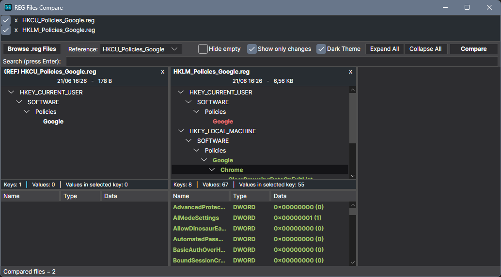

# REG Files Compare

A small Windows GUI tool to **compare multiple `.reg` files side-by-side**.

## ✨ Features

* 🗂️ **Multi-file compare** with a selectable **reference file**.
* 🌲 **Tree of keys** + 📋 **grid of values** per file, kept **in sync** (selection, scrolling, sorting).
* 🔎 **Global search** opens a dedicated results column.
* 🧹 **Show only changes** option to hide identical nodes (non-reference columns).
* 🌙 **Themes** Dark & Light.
* 🖱️ **Drag & drop** files/folders, or use **Browse** button.
* 📊 **Status bars** with totals and per-key counts.
* 🎯 **Diff highlighting**
  * 🟩 **Added**
  * 🟥 **Missing**
  * 🔵 **Different data**

---

## 📸 Screenshot

---

## Installation

**➡️ [Download Reg_Files_Compare.exe](https://github.com/Freenitial/Reg_Files_Compare/releases/latest/download/Reg_Files_Compare.exe)**

Then just double-click to open.

## Build from source (optional)

Most users don't need this — just download the executable above. If you'd rather compile it
yourself, see **[BUILD.md](https://github.com/Freenitial/Reg_Files_Compare/blob/main/BUILD.md)**.

## Requirements

- Windows 10 version 1809 (build 17763) or later, 64-bit.
